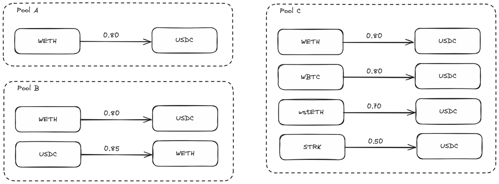

Lending markets, popularly known as lending pools, are compartmentalized lending facilities where risks are shared among depositors of a certain asset in a pool, but are strictly isolated across one another.

In this section, you will learn all about Lending markets, and how you can go about creating and enabling new Vesu lending markets.

## Architecture

Whilst lending markets can comprise of uni-directional lending pairs, they also support the creation of more complex lending configurations as a composition of various lending pairs.

Lending markets in Vesu are configured in such a way that the assets supplied in a lending pool serve as shared liquidity across all associated lending pairs, allowing for maximal capital efficiency. At the same time, this liquidity is not accessible to other Lending markets, thereby compartmentalizing risks across pools.

The diagram above, depicts a variety of lending market containing different lending pair configurations from simple uni-directional lending pairs (pool A), to reverse lending pairs (pool B) and even multi-collaterized lending pairs (pool C).