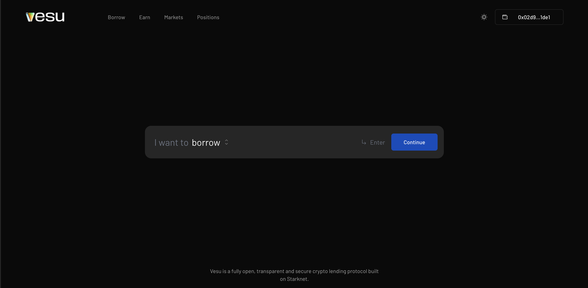
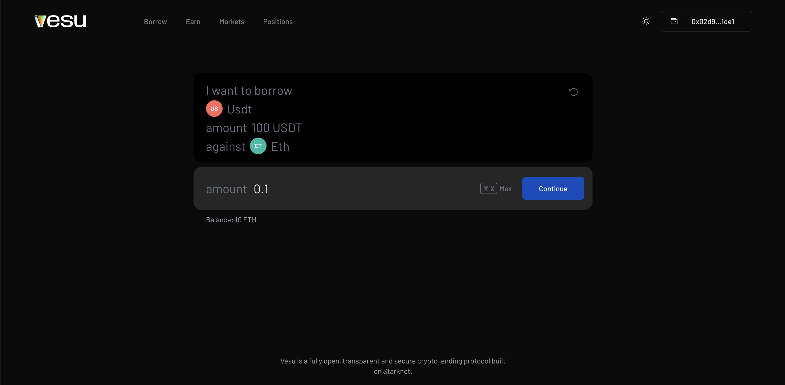
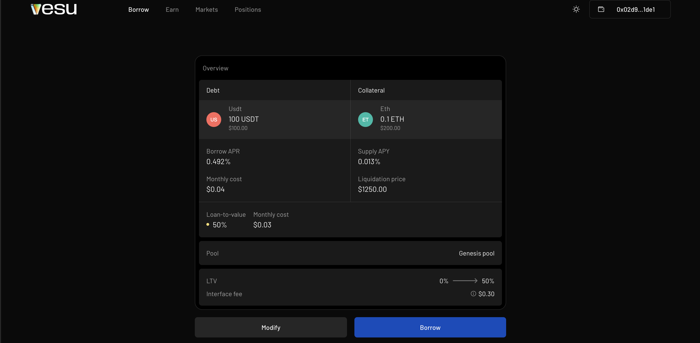
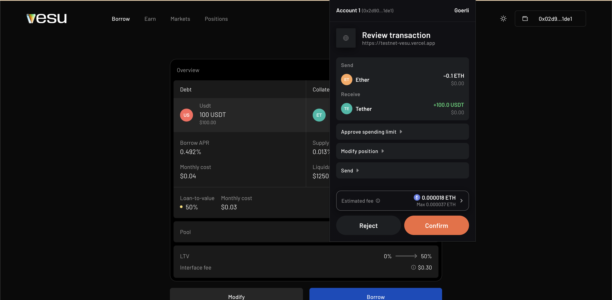

Just like every lending protocol, Vesu enables users, to borrow from existing markets.

In this guide, we will take a look at how you can go about borrowing assets from Vesu markets.

1. Head over to [Vesu](https://vesu.com) and select "I want to Borrow".

2. Select the asset you are looking to borrow. At the time of this writing we support different assets which includes ETH, WBTC, USDT, USDC, DAI, STETH, RETH and STRK.

3. Insert the amount of the selected asset, you'll like to borrow.

4. Select an asset you own and you'll like to borrow against.

5. Insert a specific amount of the asset you're willing to borrow against. Ensure it's above the minimum (calculated based on how much you intend to borrow).

6. In the next page, you can see the annual cost of opening the position. Click on "Full review" to see details such as your Borrow APR, monthly cost, loan-to-value etc.

7. You could either choose to modify your position or else, click on "Borrow".

8. Confirm your transaction using your wallet provider, to create your position.

