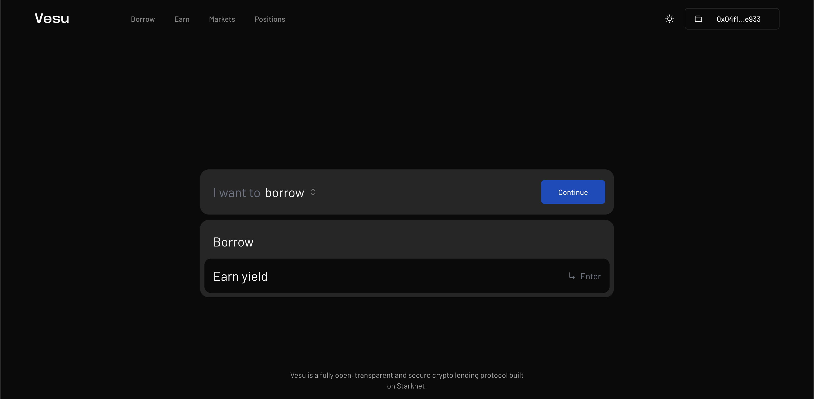
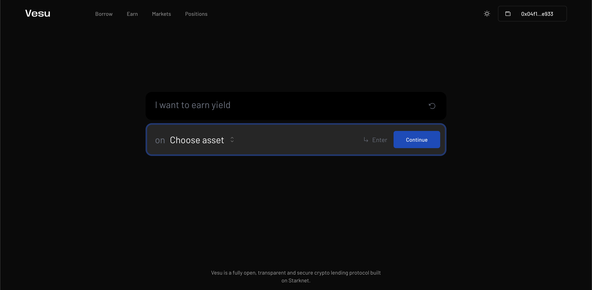
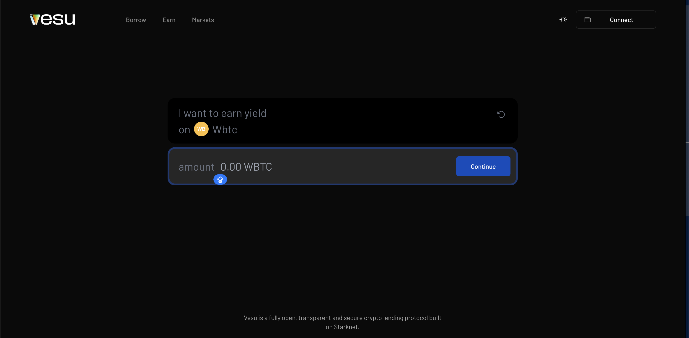
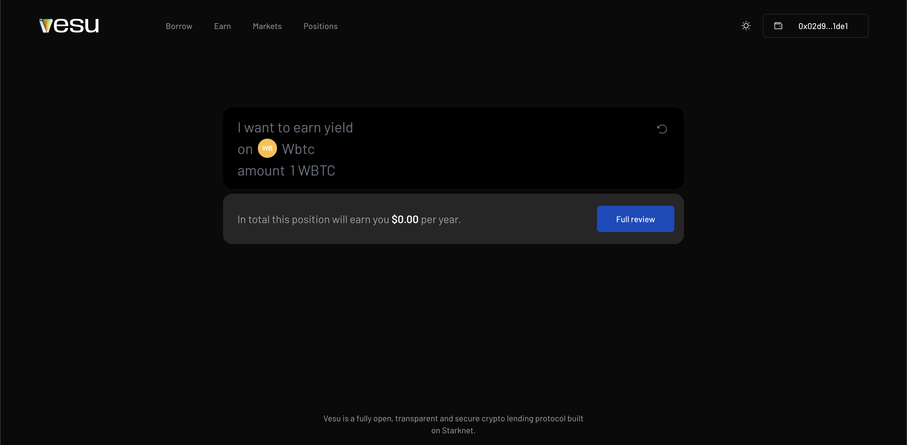
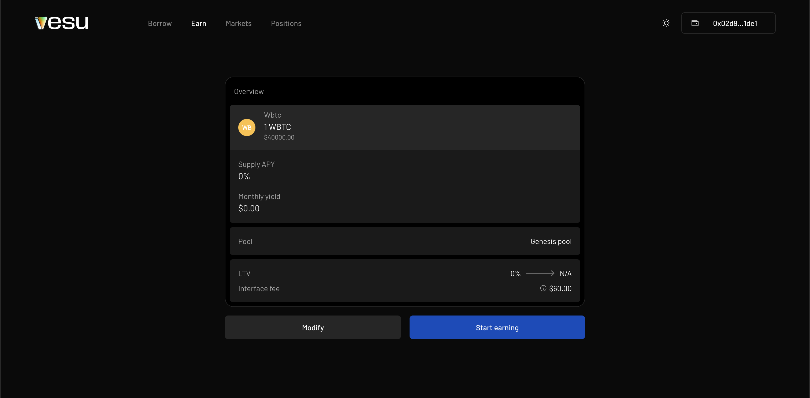
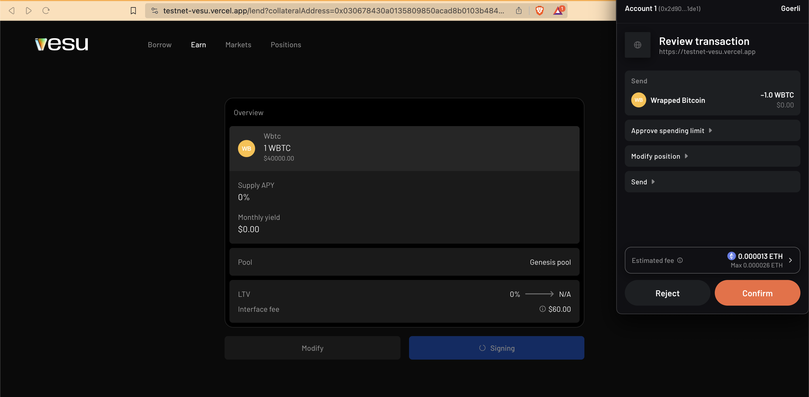

Vesu is a decentralized, permision-less protocol that enables the supplying and borrowing of different crypto assets from liquidity pools with unmatched efficiency, scalability and security.

In this simple user guide, we'll take a look at how you can go about supplying assets to markets on Vesu.

1. Head over to [Vesu](https://vesu.com) and select "I want to Earn yield"

2. Choose or select the asset you want to supply and earn yield on. We support a long list of assets, which as at the time of writing, includes ETH, WBTC, USDT, USDC, DAI, STETH, RETH and STRK.

3. Insert the amount of the selected asset, you'd like to supply.

4. In the next page, you can view the annual profitability of your position. click on "Full review" to find out more details such as the supply APY, the pool you'll be supplying to, the monthly yield, etc.

5. You could either choose to modify your position or else, click on "Start earning".

6. Finally confirm the transaction from your wallet provider, to create your position.

