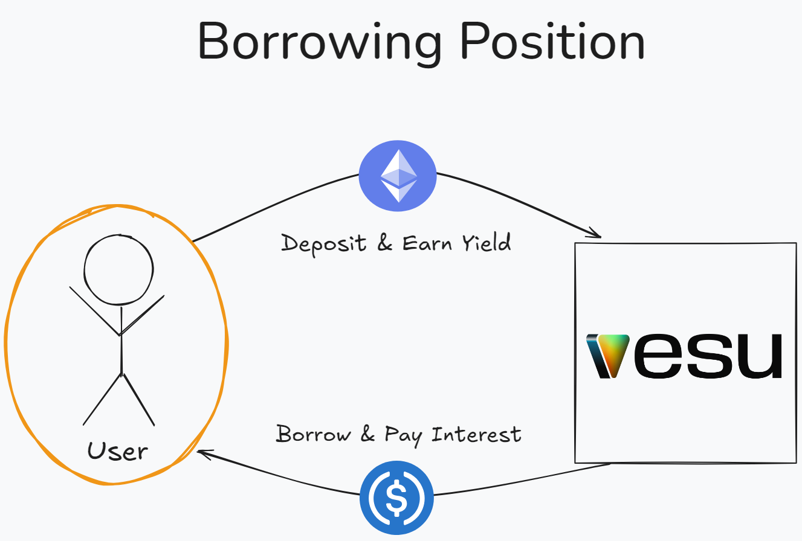
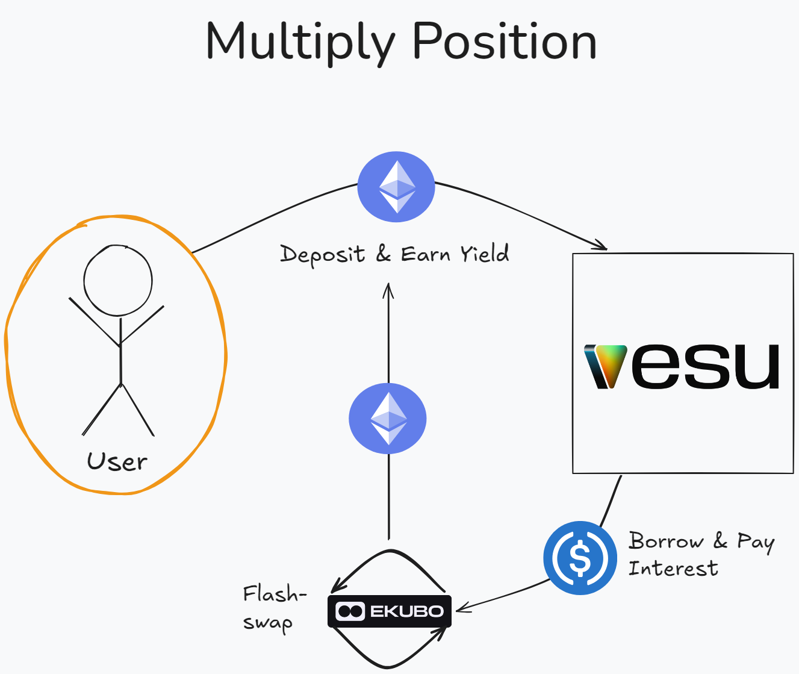
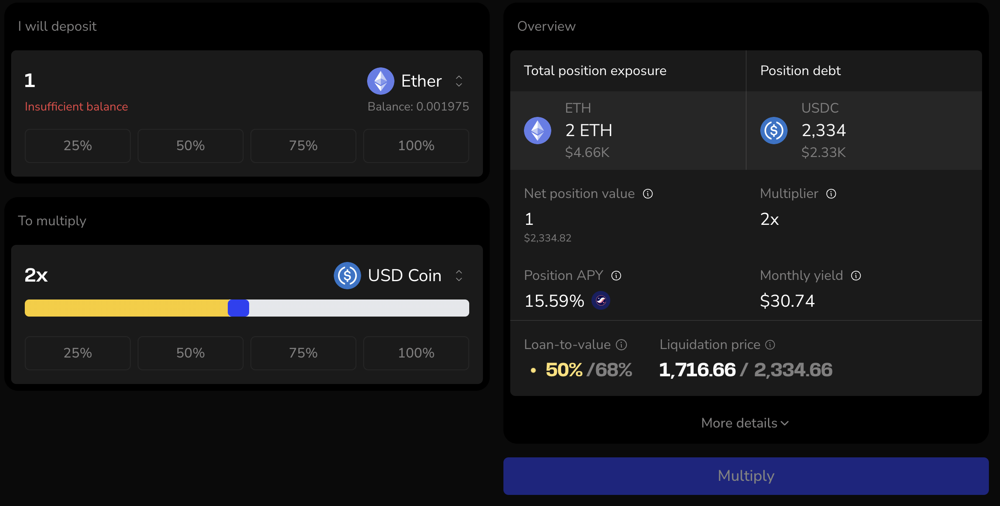

The **Multiply** feature helps users increase their exposure to an asset (e.g. ETH) and its yield with a single transaction. It’s fast and efficient, designed for users who want to boost their position without going through multiple manual steps.

## Difference Between Borrowing and Multiply
Let’s first explore how Borrowing and Multiply work, and what sets them apart.

### **Borrowing**
When you deposit a token as collateral, you can borrow another token, like USDC, which you can use however you like. Whether that’s holding it in your wallet, using it in other DeFi products, or deposit again to Vesu.

**Closing the Position:** When you close, you’ll need to repay the borrowed USDC, and once the debt is repaid, your collateral will be returned to your wallet.

### **Multiply**
This feature helps you increase exposure to the token you deposit. It’s similar to manual looping, but automated.
Here’s how it works with an example using ETH and USDC:

1. You deposit ETH into Vesu.
2. Vesu borrows USDC and swaps it for more ETH, giving you increased exposure to ETH and ETH yield.

There’s no need to repeat any steps. The whole process happens automatically in a single action.

**Closing the Position:** When you close, Vesu will use some of your ETH to repay the USDC debt, and any remaining ETH will be returned to your wallet.

## Understanding the User Interface (UI)
Let’s explore the UI with an example to understand how Multiply works and what you need to keep in mind.

In this example, you're increasing your exposure to ETH by borrowing USDC. This doubles your exposure (2x) to ETH and increases your position's APY from 8% to 15.59%, reflecting the higher potential returns but also the increased risk. Your loan-to-value (LTV) rises to 50%, and the liquidation price is set at $1,716.66, meaning that if ETH's price falls to this level, your position gets liquidated. 

If you click on "More details," you'll see a breakdown of your Multiply position. 

There you see all key parameters that influence your Multiply position as overview. In addition to these parameters, you can also:

- Adjust slippage to set the maximal difference between the expected price of a trade and the price at which the trade is executed.
- Refresh the quote to make sure the information you’re seeing is up to date, reflecting the latest market prices.

## Important Factors for Multiply Positions
When using the Multiply feature, here are some key factors to consider:

**Borrow APR vs. Supply APY**
- **Supply APY** is what you earn on assets you supply.
- **Borrow APR** is the interest you pay on borrowed assets.

The Supply APY should be higher than the Borrow APR to ensure that the yield from the supplied asset offsets the interest on borrowed funds.

**Loan-to-Value (LTV) & Liquidation Risk**
- A higher LTV increases the chance of liquidation. Keep an eye on the liquidation price, especially when borrowing volatile assets.

**Position & Market Monitoring**
Monitor both the price of the borrowed asset and the collateral. 
- Volatile assets like ETH, STRK, or wBTC can rise or fall quickly, potentially triggering liquidation.
- Stablecoins (USDC, USDC) as collateral are less risky because they hold their value.

## Conclusion
The Multiply feature offers a simple and efficient way to increase your exposure and boost potential returns with just one transaction. By understanding the key parameters and using the available information, you can optimize your strategy and manage your position effectively.