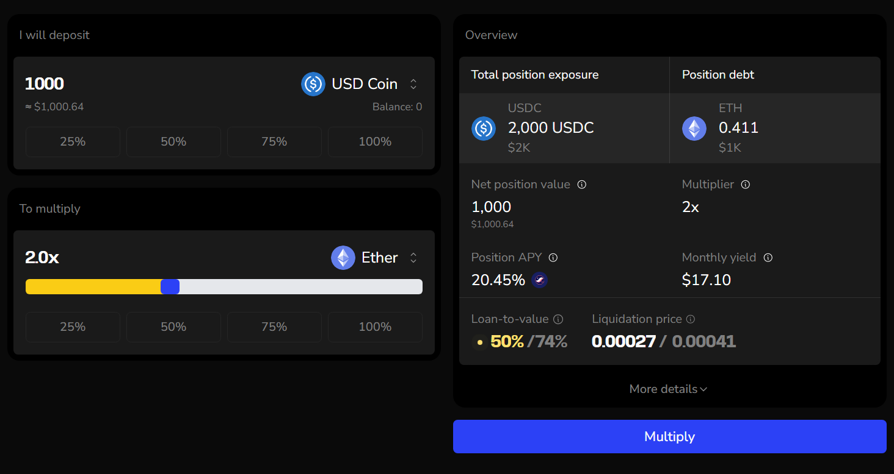
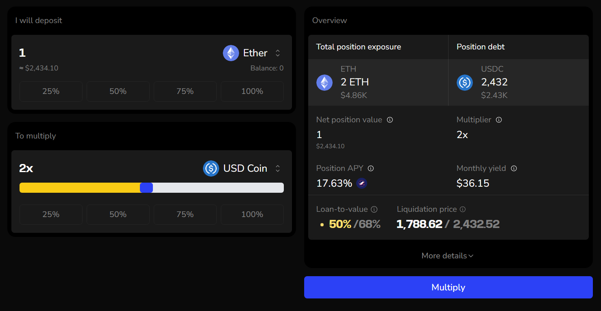
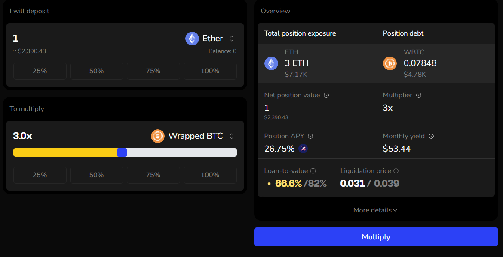
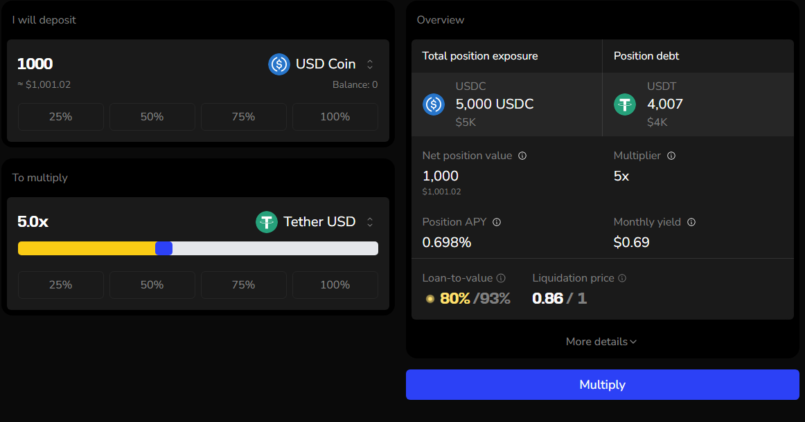
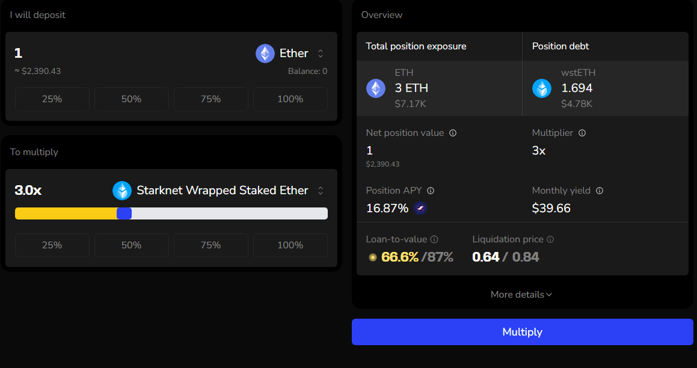

With the Multiply feature, you can increase your exposure to a single asset. Understanding the risks of the possible strategies is essential to make informed decisions. This guide offers insights into different approaches, helping you choose what aligns with your goals and risk tolerance. 

:::info
This guide is for informational purposes only and contains no financial advice. Assess your comfort level with risk and ensure you are prepared for potential market fluctuations.
:::

Before exploring specific strategies, here are general factors that affect the risk of your Multiply position. These apply to all strategies and should be monitored regularly. 

- Ensure that the **Borrow APR** is lower than the **Supply APY** to maintain profitability. If borrowing costs rise above your supply returns, your position can quickly become unprofitable.
- Stay aware of how **market utilization** impacts both **borrow** and **supply rates**. In highly utilized pools, borrowing costs can rise quickly, reducing profitability, while supply returns can improve with higher demand.
- Regularly monitor your **Loan-to-Value (LTV)** and liquidation prices, especially when borrowing volatile assets like **ETH** or **wBTC**. Keep an eye on the value of both the borrowed asset and the collateral.

Now, let’s explore the risks of possible strategies available through Multiply. 

## Summary

- **Stable Collateral, Volatile Debt**: You are effectively short on the borrowed asset (debt). Risk of losses, and potentially liquidation if the borrowed asset appreciates.
- **Volatile Collateral, Stable Debt**: You are effectively long on the deposited asset (collateral). Risk of losses, and potentially liquidation, if the collateral value drops significantly.
- **Volatile Collateral, Volatile Debt**: High risk due to exposure to fluctuations in both assets, requiring careful monitoring of their relative performance.
- **Correlated Collateral/Debt Pairs:** The assets should have very limited price movement between them, keeping liquidation risk lower compared to other strategies. Risk of unprofitability/liquidation arises if Borrow APR exceeds Supply APY or the correlation breaks.

## Stable Collateral, Volatile Debt

**Example**: Deposit **USDC**, borrow **ETH**

**Risk**: With this strategy, you are effectively short on the borrowed asset (e.g., ETH). You expect the value of the collateral to stay the same or go down over time. If the price of ETH rises, you will need to repay more USDC to cover the ETH debt. This increases your L**oan-to-Value (LTV)** ratio and can result in losses and even **liquidation**.

## Volatile Collateral, Stable Debt

**Example**: Deposit **ETH**, borrow **USDC**

**Risk**: You are effectively long on the deposited asset (e.g., ETH).  If the price of **ETH** drops, the value of your collateral decreases, raising your **LTV** ratio and increasing the risk of liquidation.

## Volatile Collateral and Debt

**Example: Deposit ETH, borrow wBTC**

**Risk**: This strategy exposes you to the price movements of two volatile assets. The unpredictability of how the two assets move in relation to each other makes this approach high risk.

If the assets are not strongly correlated, meaning for example **wBTC** appreciates faster than **ETH,** your debt becomes more expensive relative to your collateral, increasing the risk of liquidation. 

## Correlated Collateral/Debt Pairs
The idea behind this strategy is that the prices of the two assets are stable relative to each other, meaning there is no profit or loss from price movement, leading to low liquidation risk. The risk comes when the correlation breaks, leading to potential losses and liquidation.

**Example: Deposit USDC, borrow USDT**
:::info
Recursive borrowing of stablecoins is **excluded from the DeFi Spring rewards** by the Starknet Foundation. As a result, this strategy offers no additional STRK rewards.
:::

**Risk**: The main factor to consider is if the **Borrow APR** exceeds the **Supply APY**, which can make the position unprofitable. Additionally, there is a risk of de-pegging if **USDC** or **USDT** diverge from their peg, affecting the stability of the position.

**Example: Deposit ETH, borrow wstETH**

**Risk**: There is a risk of **price divergence** or **de-pegging** between **ETH** and **wstETH**. This can happen due to factors like liquidity issues, technical problems with staking protocols, or external events in stressed market conditions that cause the assets to lose their correlation, increasing the risk of liquidation and unexpected losses.

## Conclusion
Multiply positions offer a powerful way to increase your exposure, but require **continuous monitoring of market conditions, interest rates, and price movements to manage risk and stay profitable**. Adjust your strategy to current market dynamics to avoid liquidation and ensure profitable positions.