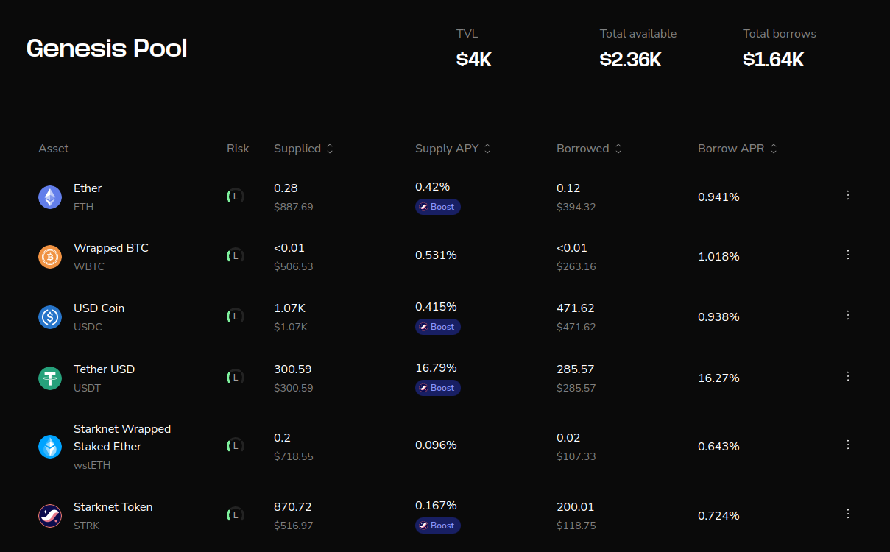

In this section, you'll learn how to navigate Vesu markets.

:::tip
You can find more information on Vesu lending markets in the [Vesu Basics](../explore/vesu-basics.md).
:::

### Markets

Markets in Vesu simply refer to a certain asset deposited and borrowed in a specific pool. The same asset can (potentially) be deposited in different pools resulting in a variety of markets for the same asset.

Let's examine the first markets and explore/breakdown all existing parts of the market.

1. TVL, Total available, Total borrows.

In the top right section of the markets page a number of statistics are shown, such as the Total Value Locked (TVL) denominated in USD, the USD-value of the Total Available liquidity and Total liquidity borrowed.

2. Markets Details

The main body of the markets page contains a table listing all the different markets and some important market details. 

In particular, for each market the supported Asset, the market's Risk rating according to the [Vesu Risk Framework](../risk/risk-framework), the total assets *Supplied*, the *Supply APY* currently offered to lenders, the total assets *Borrowed* and the *Borrow APR* reflecting the curent cost of borrowing the asset from the market.

Finally, through the dots on the right of each market entry users can directly start earning or borrowing from the market.
